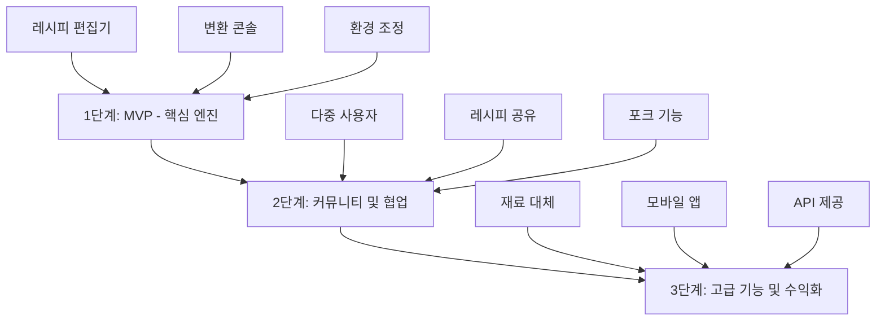

# 데이터 아키텍처 및 시스템 설계

## 🏗️ 전체 시스템 아키텍처

### 3단계 개발 로드맵 (Gemini 문서 기반)



## 📊 데이터 모델 설계

### 하이브리드 데이터베이스 전략

```javascript
// PostgreSQL - 구조화된 데이터
const postgresSchema = {
    // 사용자 테이블
    users: {
        user_id: 'SERIAL PRIMARY KEY',
        username: 'VARCHAR(100) UNIQUE NOT NULL',
        email: 'VARCHAR(255) UNIQUE NOT NULL',
        password_hash: 'VARCHAR(255) NOT NULL',
        profile_info: 'JSONB',
        preferences: 'JSONB DEFAULT \'{}\'',
        created_at: 'TIMESTAMP DEFAULT CURRENT_TIMESTAMP'
    },
    
    // 재료 마스터
    ingredients: {
        ingredient_id: 'SERIAL PRIMARY KEY',
        name: 'VARCHAR(255) NOT NULL',
        name_en: 'VARCHAR(255)',
        category: 'VARCHAR(100)',
        density: 'DECIMAL(10,4)', // g/ml 변환용
        allergens: 'TEXT[]',
        substitutes: 'INTEGER[]' // 대체 가능 재료 ID
    },
    
    // 팬 라이브러리
    pan_library: {
        pan_id: 'SERIAL PRIMARY KEY',
        pan_name: 'VARCHAR(255)',
        pan_name_en: 'VARCHAR(255)',
        shape_type: 'VARCHAR(50)',
        dimensions: 'JSONB',
        volume_cm3: 'DECIMAL(10,2)',
        manufacturer: 'VARCHAR(100)',
        is_standard: 'BOOLEAN DEFAULT false'
    },
    
    // 변환 규칙 (버전 관리 포함)
    conversion_rules: {
        rule_id: 'SERIAL PRIMARY KEY',
        source_method: 'VARCHAR(50)',
        target_method: 'VARCHAR(50)',
        ruleset: 'JSONB NOT NULL',
        version: 'INTEGER DEFAULT 1',
        is_active: 'BOOLEAN DEFAULT true',
        created_at: 'TIMESTAMP DEFAULT CURRENT_TIMESTAMP',
        created_by: 'INTEGER REFERENCES users(user_id)'
    },
    
    // 사용자-레시피 관계
    user_recipes: {
        user_id: 'INTEGER REFERENCES users(user_id)',
        recipe_id: 'VARCHAR(255)', // MongoDB ObjectId
        status: 'VARCHAR(50)', // owned, forked, bookmarked
        forked_from: 'VARCHAR(255)',
        created_at: 'TIMESTAMP DEFAULT CURRENT_TIMESTAMP'
    }
};

// MongoDB - 유연한 레시피 데이터
const mongoSchema = {
    // 레시피 컬렉션
    recipes: {
        _id: 'ObjectId',
        recipe_id: 'String', // UUID
        author_id: 'Number', // PostgreSQL user_id
        title: 'String',
        description: 'String',
        is_public: 'Boolean',
        forked_from_id: 'String',
        
        // 베이커스 퍼센트 기반 데이터
        recipe_data: {
            base_flour_weight: 'Number', // 기준 밀가루량
            ingredients: [{
                ingredient_id: 'Number', // PostgreSQL reference
                name: 'String',
                amount: 'Number',
                unit: 'String',
                baker_percentage: 'Number',
                category: 'String',
                step_number: 'Number'
            }],
            
            // 공정 단계 (Gemini 문서 강조)
            process_steps: [{
                step_number: 'Number',
                type: 'String', // mixing, fermentation, shaping, etc.
                description: 'String',
                duration: 'Number', // minutes
                temperature: 'Number', // celsius
                ingredients_used: ['ingredient_ids']
            }],
            
            // 환경 설정
            environment_settings: {
                room_temp: 'Number',
                flour_temp: 'Number',
                humidity: 'Number',
                altitude: 'Number'
            }
        },
        
        // 메타데이터
        metadata: {
            tags: ['String'],
            difficulty: 'String',
            total_time: 'Number',
            equipment: ['String'],
            ratings: {
                average: 'Number',
                count: 'Number'
            }
        },
        
        created_at: 'Date',
        updated_at: 'Date'
    },
    
    // 변환 이력 (감사 추적)
    conversion_history: {
        _id: 'ObjectId',
        original_recipe_id: 'String',
        converted_recipe_id: 'String',
        conversion_params: {
            method: 'String',
            pan: 'Object',
            environment: 'Object'
        },
        explanations: ['Object'], // 변경 사항 설명
        user_id: 'Number',
        created_at: 'Date'
    }
};
```

## 🔄 데이터 플로우 아키텍처

### 레시피 변환 파이프라인

```javascript
class RecipeConversionPipeline {
    constructor() {
        this.stages = [
            'validation',
            'normalization',
            'methodConversion',
            'environmentalAdjustment',
            'panScaling',
            'finalCalculation',
            'explanation'
        ];
    }
    
    async process(recipe, options) {
        const pipeline = {
            input: recipe,
            options: options,
            results: {},
            metadata: {
                startTime: Date.now(),
                stages: []
            }
        };
        
        for (const stage of this.stages) {
            try {
                pipeline.results[stage] = await this[stage](pipeline);
                pipeline.metadata.stages.push({
                    name: stage,
                    success: true,
                    timestamp: Date.now()
                });
            } catch (error) {
                pipeline.metadata.stages.push({
                    name: stage,
                    success: false,
                    error: error.message,
                    timestamp: Date.now()
                });
                break;
            }
        }
        
        return pipeline;
    }
    
    // 각 단계별 구현
    async validation(pipeline) {
        // 레시피 데이터 검증
        const validator = new RecipeValidator();
        return validator.validate(pipeline.input);
    }
    
    async normalization(pipeline) {
        // 베이커스 퍼센트로 정규화
        return BakersPercentage.normalizeRecipe(pipeline.input.ingredients);
    }
    
    // ... 기타 단계들
}
```

## 🎯 UI/UX 화면 구조 (Gemini 문서 기반)

### 주요 화면 컴포넌트

```javascript
const UIScreens = {
    // 1. 대시보드
    dashboard: {
        components: [
            'RecentRecipes',      // 최근 작업
            'CommunityPopular',   // 인기 레시피
            'PersonalizedRecs',   // 맞춤 추천
            'QuickActions'        // 빠른 작업
        ],
        layout: 'grid'
    },
    
    // 2. 레시피 편집기
    recipeEditor: {
        components: [
            'IngredientTable',    // 재료 입력
            'BakerPercentView',   // 베이커스 % 표시
            'ProcessSteps',       // 공정 단계
            'RecipeImporter'      // 텍스트 임포터
        ],
        features: [
            'auto-calculate',     // 자동 계산
            'validation',         // 실시간 검증
            'save-draft'          // 임시 저장
        ]
    },
    
    // 3. 변환 콘솔 (시그니처 화면)
    conversionConsole: {
        layout: 'two-panel',
        leftPanel: 'OriginalRecipe',
        rightPanel: 'ConvertedRecipe',
        
        controlPanel: {
            method: 'DropdownSelector',
            pan: 'PanSelector',
            environment: 'EnvironmentSliders'
        },
        
        features: [
            'real-time-update',   // 실시간 업데이트
            'explainability',     // 변경 사항 설명
            'comparison-view'     // 비교 보기
        ]
    },
    
    // 4. 커뮤니티 허브
    communityHub: {
        components: [
            'RecipeGrid',         // 카드 레이아웃
            'SearchFilters',      // 검색/필터
            'TagCloud',           // 인기 태그
            'UserProfiles'        // 사용자 프로필
        ],
        
        features: [
            'fork-recipe',        // 레시피 포크
            'rate-comment',       // 평가/댓글
            'share-embed'         // 공유/임베드
        ]
    }
};
```

## 🔐 데이터 보안 및 프라이버시

### 클라이언트 사이드 보안

```javascript
class ClientSideSecurity {
    // 민감 정보 제외
    static sanitizeRecipeForStorage(recipe) {
        const sanitized = { ...recipe };
        
        // 개인 정보 제거
        delete sanitized.author.email;
        delete sanitized.author.phone;
        
        // XSS 방지
        sanitized.title = this.escapeHtml(sanitized.title);
        sanitized.description = this.escapeHtml(sanitized.description);
        
        return sanitized;
    }
    
    // 로컬 저장소 암호화
    static encryptForLocalStorage(data) {
        // 간단한 암호화 (실제로는 더 강력한 방법 사용)
        const key = this.getUserKey();
        return this.simpleEncrypt(JSON.stringify(data), key);
    }
    
    // 데이터 유효성 검증
    static validateImportedData(data) {
        const schema = {
            type: 'object',
            required: ['title', 'ingredients'],
            properties: {
                title: { type: 'string', maxLength: 200 },
                ingredients: {
                    type: 'array',
                    items: {
                        type: 'object',
                        required: ['name', 'amount', 'unit']
                    }
                }
            }
        };
        
        return this.validateAgainstSchema(data, schema);
    }
}
```

## 📈 성능 최적화 전략

### 캐싱 계층

```javascript
class CachingStrategy {
    constructor() {
        this.layers = {
            memory: new Map(),           // 메모리 캐시
            localStorage: window.localStorage,
            indexedDB: null              // 대용량 데이터
        };
    }
    
    // 다층 캐싱
    async get(key) {
        // 1. 메모리 확인
        if (this.layers.memory.has(key)) {
            return this.layers.memory.get(key);
        }
        
        // 2. localStorage 확인
        const localData = this.layers.localStorage.getItem(key);
        if (localData) {
            const parsed = JSON.parse(localData);
            this.layers.memory.set(key, parsed);
            return parsed;
        }
        
        // 3. IndexedDB 확인
        const dbData = await this.getFromIndexedDB(key);
        if (dbData) {
            this.layers.memory.set(key, dbData);
            this.layers.localStorage.setItem(key, JSON.stringify(dbData));
            return dbData;
        }
        
        return null;
    }
    
    // 캐시 무효화 전략
    invalidate(pattern) {
        // 패턴에 맞는 모든 캐시 삭제
        for (const [key] of this.layers.memory) {
            if (key.match(pattern)) {
                this.layers.memory.delete(key);
            }
        }
        
        // localStorage 정리
        for (let i = 0; i < this.layers.localStorage.length; i++) {
            const key = this.layers.localStorage.key(i);
            if (key.match(pattern)) {
                this.layers.localStorage.removeItem(key);
            }
        }
    }
}
```

## 🌐 오프라인 우선 아키텍처

### 동기화 전략

```javascript
class OfflineFirstSync {
    constructor() {
        this.syncQueue = [];
        this.isOnline = navigator.onLine;
        
        window.addEventListener('online', () => this.handleOnline());
        window.addEventListener('offline', () => this.handleOffline());
    }
    
    // 오프라인 작업 큐잉
    queueOperation(operation) {
        operation.id = this.generateOperationId();
        operation.timestamp = Date.now();
        operation.status = 'pending';
        
        this.syncQueue.push(operation);
        this.saveQueueToStorage();
        
        if (this.isOnline) {
            this.processSyncQueue();
        }
    }
    
    // 온라인 전환 시 동기화
    async handleOnline() {
        this.isOnline = true;
        await this.processSyncQueue();
    }
    
    // 충돌 해결
    async resolveConflicts(localData, remoteData) {
        // 타임스탬프 기반 해결
        if (localData.updatedAt > remoteData.updatedAt) {
            return {
                action: 'use_local',
                data: localData,
                backup: remoteData
            };
        }
        
        // 사용자에게 선택 요청
        return {
            action: 'ask_user',
            local: localData,
            remote: remoteData
        };
    }
}
```

## 💾 데이터 마이그레이션

### 버전 관리 시스템

```javascript
class DataMigration {
    static migrations = {
        '1.0.0': {
            up: (data) => data, // 초기 버전
            down: (data) => data
        },
        
        '2.0.0': {
            up: (data) => {
                // 베이커스 퍼센트 추가
                data.recipes = data.recipes.map(recipe => ({
                    ...recipe,
                    ingredients: BakersPercentage.normalizeRecipe(recipe.ingredients)
                }));
                return data;
            },
            down: (data) => {
                // 베이커스 퍼센트 제거
                data.recipes = data.recipes.map(recipe => ({
                    ...recipe,
                    ingredients: recipe.ingredients.map(ing => {
                        delete ing.bakerPercentage;
                        return ing;
                    })
                }));
                return data;
            }
        }
    };
    
    static async migrate(currentVersion, targetVersion, data) {
        const versions = Object.keys(this.migrations).sort();
        const currentIndex = versions.indexOf(currentVersion);
        const targetIndex = versions.indexOf(targetVersion);
        
        if (currentIndex === targetIndex) return data;
        
        const direction = currentIndex < targetIndex ? 'up' : 'down';
        const range = direction === 'up' 
            ? versions.slice(currentIndex + 1, targetIndex + 1)
            : versions.slice(targetIndex, currentIndex).reverse();
        
        let migratedData = data;
        for (const version of range) {
            migratedData = await this.migrations[version][direction](migratedData);
        }
        
        return migratedData;
    }
}
```

## 🚀 확장 가능한 아키텍처

### 마이크로서비스 접근 (선택사항)

```javascript
// 향후 확장을 위한 서비스 분리
const microservices = {
    // 핵심 서비스 (필수)
    core: {
        recipeEngine: 'http://localhost:3001',    // 레시피 변환
        userService: 'http://localhost:3002',     // 사용자 관리
        storageService: 'http://localhost:3003'   // 데이터 저장
    },
    
    // 선택적 서비스
    optional: {
        analyticsService: null,    // 사용 분석
        imageService: null,        // 이미지 처리
        exportService: null,       // PDF/인쇄 생성
        aiService: null           // AI 추천
    }
};

// 서비스 통신 레이어
class ServiceCommunicator {
    async callService(serviceName, endpoint, data) {
        const serviceUrl = microservices.core[serviceName] || 
                          microservices.optional[serviceName];
        
        if (!serviceUrl) {
            // 폴백: 로컬 처리
            return this.handleLocally(serviceName, endpoint, data);
        }
        
        try {
            const response = await fetch(`${serviceUrl}${endpoint}`, {
                method: 'POST',
                headers: { 'Content-Type': 'application/json' },
                body: JSON.stringify(data)
            });
            
            return await response.json();
        } catch (error) {
            // 오프라인 폴백
            return this.handleLocally(serviceName, endpoint, data);
        }
    }
}
```

이 아키텍처는 Gemini 문서의 체계적 접근과 무료 웹 애플리케이션 요구사항을 통합한 것입니다.